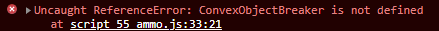

# Primera parte 🐼
Para el desarrollo de la primera parte de la práctica, basé 
las imágenes de la IA [Dall-e](https://labs.openai.com/) para mostrarlas haciendo uso de 
tweens, de forma que se fuesen mostrando 1 a 1 y se colocaran
en un espacio en concreto sobre la escena.

# Segunda parte 🎱
Para el desarrollo de la segunda parte de la práctica y haciendo 
referencia a algunos ejemplos vistos en la clase 
práctica. 

Me descargué todos los ficheros nombrados desde 
[Index of /threejs/examples/js](https://pyxish.com/threejs/examples/js/).

## Primer intento por hacer algo útil 🥲
* Lo primero que pensé fué en hacer que los bloques se rompieran al contacto con la bola, como se comprueba en 
[ConvexObjectBreaker](https://sbcode.net/threejs/convexobjectbreaker/) y en [ejemplo de físicas Ammo/break](https://threejs.org/examples/physics_ammo_break.html). **No** funcionó, ya que me daban muchos errores de las librerías que se usaban en el ejemplo. en concreto: 

* Desistí, aunque dejé el código para que se viera mi intención.
---
## Segundo intento por hacer algo útil ☹️
* A continuación, y recordando la sábana de ejemplo y algún 
  que otro git como [ejemplo de físicas Ammo/cloth](https://threejs.org/examples/physics_ammo_cloth.html), 
  [ejemplo de físicas Ammo/volume](https://threejs.org/examples/physics_ammo_volume.html), 
  decidí hacer que la bola fuese un objeto soft en 
  vez de rigid, y que al colisionar con los bloques, quedara a modo cómico que la bola se distorsionara como si fuera un 
  globo.
* (Spoiler) La librería "BufferGeometryUtils", necesaria para
  que esto funcionara, tampoco me funcionó, por lo 
  que tuve que seguir buscando algo que hacer para ver si funcionaba.
* Desistí, y volví a dejar el código para que se viera mi intención.

---
## Tercer intento por hacer algo útil 😓
Teniendo de referencia la página [sbcide.net](https://sbcode.net/threejs/convexobjectbreaker/), 
seguí los pasos de instalación para ThreeJS y Ammo en un proyecto a parte para recoger las 
librerías oficiales. 
En el momento en el que tenía todas las librerías necesarias (Las he dejado en el proyecto final)
para los 2 ejercicios que me propuse,empecé a copiar y pegar tales librerías en mi proyecto 
P11-IG-CJJG... para comprobar su funcionamiento.
Tras intentar arrglar ciertos fallos debido a la diferencia de directorios
seguía sin funcionar.

---
## Cuarto intento por hacer algo útil 😭

Como último intento, he decidio crear algúna figura extra, como en 
[ejemplo de físicas Ammo/break](https://threejs.org/examples/physics_ammo_break.html), 
para que haya algo de variedad contra lo que lanzar la pelota.

---
## Intento por que parezca que he hecho algo que no sea solo intentar solucionar problemas...🤓

Una de las pocas cosas que salión bien a la primera fue 
colocar el contador de FPS/ms, basado en [sbcode.net](https://sbcode.net/threejs/stats-panel/)
en la esquina inferior izquierda.

Decidí cambiar las físicas de los bloques. Hacerlos más grandes, y por tanto, que su masa fuera mayor. De esta forma, la bola no moría tanto los bloques, dando la impresión de que pesan más.

Se alteraron los materiales de la bola que se lanza:
* color: 0x333333
* metalness: 1.
* roughness: .25
* transparent: true
* opacity: .75

